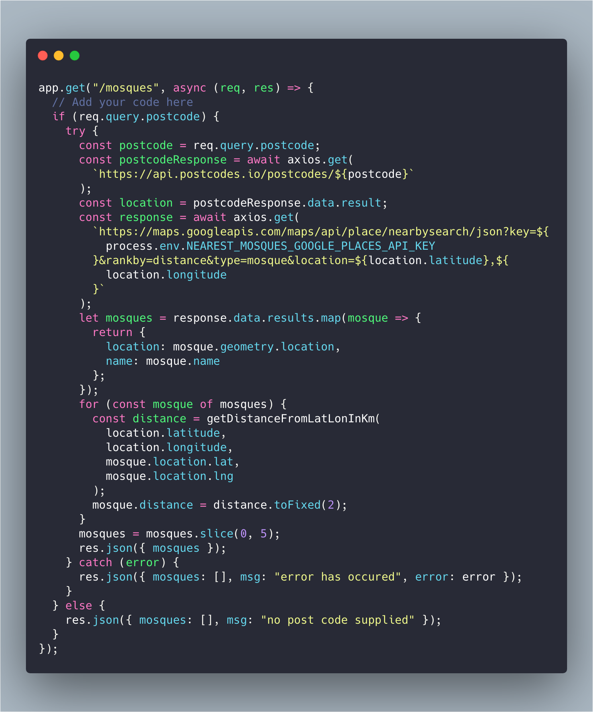

I wanted to be able to pray at a mosque during the days I worked remotely. To do that, I needed a co-working space that was near a mosque. I needed a way to check if a co-working space was near a mosque.

I remembered that Google Places API can find nearby places. The Google Places API has place types and mosque is one of those types. In order to use Google Places API, I needed to convert postcodes into latitude and longitude. I used [Postcodes.io API](https://postcodes.io) to get latitude and longitude for postcodes. I needed to know how close mosques were to co-working spaces and to do that, I needed to calculate distances between coordinates. To do that, I used the [Haversine formula](https://en.wikipedia.org/wiki/Haversine_formula).

I have read good things about AWS Amplify and how how easy it made connecting UI to a backend hosted in AWS. I had already used AWS Lambda and therefore, there was be no learning curve. For the front-end, AWS Amplify uses [create-react-app](https://github.com/facebook/create-react-app) and having used create-react-app for many projects, there was be no learning curve once again. AWS Amplify hosts react projects on S3 and that has simplified hosting.

AWS Amplify made working on this project a breeze and I was genuinely surprised at how quickly I completed the project. Thankfully, I didn't need to use DynamoDB for this project. DynamoDB would have been a significant learning curve as I haven't used it before. I also didn't need to use other features of AWS Amplify, like Authentication.

You can find the complete code for this post in the following <a href="https://github.com/puntnomads/NearestMosques" target="_blank">Github repository</a>.
