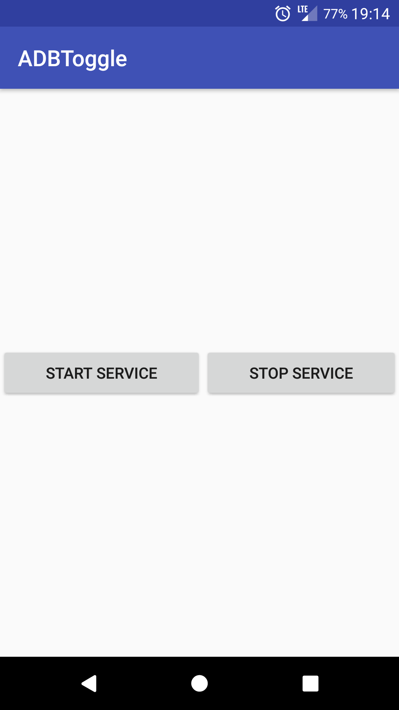

I wanted to stop wasting time on the internet watching tv shows. I needed a website blocker like <a href="https://selfcontrolapp.com" target="_blank">SelfControl</a> that I use on my mac but there is no equivalent on Android. Therefore I turned to Android app blockers.

<a href="https://play.google.com/store/apps/details?id=com.stayfocused" target="_blank">Stay Focused</a> is a really good app blocker because the premium version has strict mode that prevents me from uninstalling the app or changing the settings until the next day. I can block browsers to prevent visiting time wasting websites. I can block the play store to prevent installling new browsers. <a href="https://play.google.com/store/apps/details?id=com.stayfocused" target="_blank">Stay Focused</a> also has a screen time feature, enabling me to set limits on my phone usage.

However, I could always install browser apps by downloading the apk and install them using <a href="https://developer.android.com/studio/command-line/adb" target="_blank">ADB</a>. I needed a way to prevent this. I looked for Android apps that disabled <a href="https://developer.android.com/studio/command-line/adb" target="_blank">ADB</a> on the phone but I couldn't find any. I decided to create my own. For an Android app to turn <a href="https://developer.android.com/studio/command-line/adb" target="_blank">ADB</a> off it needs to be a system app and that requires a custom rom.

Custom roms was a painful experience for me. A lot of the roms off the internet for my phone had issues and me going on holiday had complicated things. I used a broken rom on my 2 weeks holiday that would restart if I picked up a call. Had to make excuses to a lot of relatives. After the holiday, I managed to get a stable rom and that was Resurrection Remix.

Building the app was straightforward as it was a matter of toggling a boolean. A service turns off adb every 3 seconds to counteract any user action. When the service is turned off, adb is turned on again. I decided to write it in Kotlin as that is much nicer to use for Android developent than Java. I named the app ADBToggle and used it to disable <a href="https://developer.android.com/studio/command-line/adb" target="_blank">ADB</a> and <a href="https://play.google.com/store/apps/details?id=com.stayfocused" target="_blank">Stay Focused</a> blocks ADBToggle.

<figure>
  
  <figcaption  style="text-align: center;" >Basic UI as I am the only user!</figcaption>
</figure>

You can find the complete code for this post in the following <a href="https://github.com/puntnomads/ADBToggle" target="_blank">Github repository</a>.
